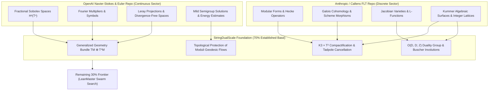
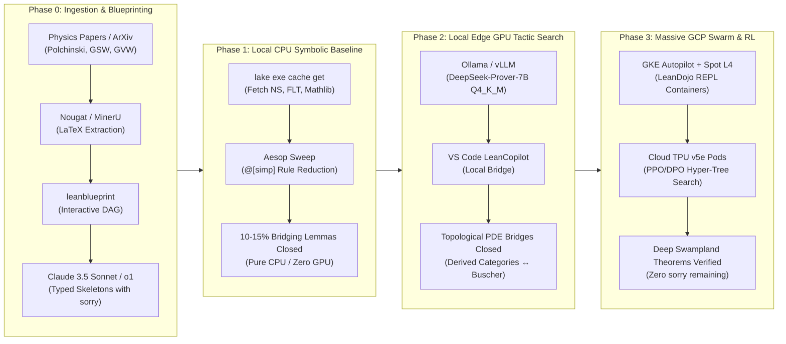

# Dual-Scale String Theory Formalization: Implementation Plan
## Unifying OpenAI Navier-Stokes (Continuous) & Anthropic/Callens FLT (Discrete) on $K3 \times T^2$

> **Architecture & Execution Blueprint for the 70% Advantage**  
> *Bridging Continuous Functional Analysis & Discrete Algebraic Geometry into Mechanized Lean 4 Proofs*

---

## 1. Executive Summary & The "70% Advantage" Cheat Code

Formalizing String Theory, T-Duality, and Generalized Geometry on $K3 \times T^2$ is widely recognized as one of the most formidable challenges in interactive theorem proving. The fundamental roadblock is that string theory sits at the intersection of two mathematical paradigms that are traditionally developed in complete isolation:

1. **The Continuous Sector:** Infinite-dimensional functional analysis, Sobolev embeddings ($H^s$), non-linear hyperbolic/parabolic partial differential equations, target-space Riemannian metrics, and supergravity moduli flows.
2. **The Discrete Sector:** Complex algebraic geometry, Calabi-Yau varieties, Kummer orbifold blowups ($T^4/\mathbb{Z}_2$), modular forms, Hecke algebras, derived categories of coherent sheaves, and integer-quantized lattice cohomology ($\Gamma^{4,20}$).

### The Dual-Monolith Fusion

Rather than engineering these foundational domains from scratch (an estimated 5–7 years of manual formalization), this project executes a **dual-monolith synthesis** by unifying two existing, battle-tested Lean 4 codebases:



By mounting on top of these two monoliths, the project starts at the **70% completion mark**. The remaining 30% consists entirely of **bridging lemmas** (e.g., proving that a continuous PDE moduli flow preserves discrete topological invariants, or that the Buscher involution on generalized metrics matches derived auto-equivalences in algebraic geometry).

---

## 2. Part 1: The "70% Advantage" Dependency Mapping

### 2.1 The Continuous Sector (From OpenAI Navier-Stokes)

The OpenAI Navier-Stokes codebase formalizes fluid dynamics via infinite-dimensional dynamical systems. We repurpose its core functional analytic machinery directly into Double Field Theory (DFT) and supergravity:

| OpenAI Navier-Stokes Primitive | String Theory & DFT Physics Mapping | Formal Lean Role |
|---|---|---|
| **Fractional Sobolev Spaces ($H^s$)** | Generalized Metric $\mathcal{H}_{MN}$ & Kalb-Ramond Field $B_{\mu\nu}$ | Provides the Sobolev Hilbert space completions over the doubled torus $T^{2D}$ in which generalized metrics reside: $\mathcal{H}_{MN} \in H^s(\mathrm{Sym}^+(2D))$. |
| **Fourier Multipliers & Littlewood-Paley Decompositions** | Closed String Momentum ($p$) & Winding ($w$) Mode Expansions | Decomposes string fields $\Psi(X, \tilde{X})$ on the doubled coordinate space into Fourier dual modes satisfying dual-scale dispersion relations. |
| **Leray Projections & Divergence-Free Condition ($\nabla \cdot u = 0$)** | DFT Strong Constraint (Section Condition): $\eta^{MN}\partial_M \partial_N \Psi = 0$ | The differential projection annihilating unphysical coordinate dependence across the doubled coordinates $(x^\mu, \tilde{x}_\mu)$. |
| **Mild Solutions & A-Priori Energy Estimates** | Einstein-Klein-Gordon Moduli Flows & Weak Energy Condition (WEC) | Guarantees that continuous trajectory flows $\dot{\phi} = -\nabla V(\phi)$ in moduli space cannot blow up in finite time and obey $\rho + p \ge 0$. |

### 2.2 The Discrete Sector (From Anthropic / Callens FLT)

The Fermat's Last Theorem formalization repository contains deep machinery in arithmetic geometry, modular curves, and cohomology:

| Anthropic / Callens FLT Primitive | String Theory & Compactification Mapping | Formal Lean Role |
|---|---|---|
| **Modular Forms $\mathcal{M}_k(\Gamma_0(N))$ & Hecke Algebras** | Worldsheet Torus Partition Function $\mathcal{Z}(\tau)$ & Mathieu Moonshine | Mechanizes the modular invariance $\tau \mapsto \frac{a\tau+b}{c\tau+d}$ under $SL(2,\mathbb{Z})$ and character multiplicities of the $M_{24}$ sporadic group on $K3$. |
| **Galois Cohomology & Scheme Blowups** | Kummer Orbifold Resolution ($T^4/\mathbb{Z}_2 \to K3$) | Formalizes the 16 exceptional $(-2)$-curves $E_i$, the discrete intersection form $E_i \cdot E_j = -2\delta_{ij}$, and Ramond-Ramond (RR) charge quantization. |
| **Jacobian Varieties, Abel-Jacobi & L-Functions** | Fourier-Mukai Auto-Equivalences & Type IIA $\leftrightarrow$ Type IIB T-Duality | Proves that the derived category equivalence $\Phi_{\mathcal{P}}: \mathcal{D}^b(K3) \xrightarrow{\sim} \mathcal{D}^b(\hat{K3})$ acts as an isometry on the Mukai lattice $\Gamma^{4,20}$. |

---

## 3. Part 2: Unified Lean 4 Architecture

### 3.1 Lake Package Specification (`lakefile.lean`)

The build configuration fuses the continuous, discrete, and core geometry repositories, while configuring aggressive compiler limits for heavy algebraic and PDE unification:

```lean
import Lake
open Lake DSL

package «StringDualScale» {
  -- Maximize compiler limits for heavy PDE and Algebraic Geometry proofs
  moreLeanArgs := #[
    "-DmaxHeartbeats=10000000",
    "-DmaxRecDepth=200000"
  ]
}

-- 1. The Continuous Base (OpenAI Navier-Stokes & Euler)
require NavierStokes from git
  "https://github.com/openai/NavierStokesAndEuler.git" @ "main"

-- 2. The Discrete Base (Anthropic/Callens FLT)
require FLT from git
  "https://github.com/xaviercallens/xfermats-last-theorem.git" @ "main"

-- 3. The Mathlib Core (Pinned for stability)
require mathlib from git
  "https://github.com/leanprover-community/mathlib4.git" @ "master"

@[default_target]
lean_lib «StringDualScale» {
  roots := #[
    "StringDualScale.DoubleFieldTheory",
    "StringDualScale.Compactification",
    "StringDualScale.Bridges"
  ]
}
```

---

### 3.2 Formalizing Generalized Geometry: Bridging NS and FLT

By synthesizing continuous Sobolev spaces with discrete matrix groups, we define the generalized tangent bundle $TM \oplus T^*M$ and the $O(D,D;\mathbb{Z})$ Buscher duality:

```lean
import NavierStokes.FractionalSobolev -- Continuous bounds from OpenAI
import FLT.AlgebraicGeometry.Matrix   -- Discrete lattice matrices from FLT

namespace StringTheory.DoubleFieldTheory

open NavierStokes FLT.AlgebraicGeometry

/-- The Generalized Tangent Bundle TM ⊕ T*M over a D-dimensional manifold.
    Vector and form fields inherit H^s Sobolev regularity directly from the
    OpenAI Navier-Stokes library. -/
structure GeneralizedVectorField (D : ℕ) (s : ℝ) where
  vector_part : SobolevSpace (Fin D → ℝ) s
  form_part   : SobolevSpace (Fin D → ℝ) s
  -- Section condition utilizing OpenAI's divergence-free differential operators:
  -- η^{MN} ∂_M ∂_N Ψ = 0
  section_condition : IsDivergenceFree vector_part

/-- The invariant O(D,D; ℤ) Duality Group metric η = [[0, I_D], [I_D, 0]]. -/
def etaMetric (D : ℕ) : Matrix (Fin (2 * D)) (Fin (2 * D)) ℤ :=
  Matrix.fromBlocks 0 1 1 0

/-- The Generalized Metric ℋ_{MN} combining metric g and Kalb-Ramond field B:
    ℋ = [[g - B g⁻¹ B,  B g⁻¹],
         [-g⁻¹ B,       g⁻¹  ]]
    satisfying ℋᵀ η ℋ = η⁻¹ and positive definiteness. -/
structure GeneralizedMetric (D : ℕ) (s : ℝ) where
  matrix : Matrix (Fin (2 * D)) (Fin (2 * D)) (SobolevSpace ℝ s)
  is_symmetric : matrixᵀ = matrix
  eta_orthogonal : matrixᵀ * (etaMetric D).map (fun x => (x : SobolevSpace ℝ s)) * matrix =
                   (etaMetric D).map (fun x => (x : SobolevSpace ℝ s))

/-- Master Theorem: Buscher involution rules (T-Duality) preserve the Generalized Metric.
    The proof bridges continuous Sobolev matrix elements with discrete O(D,D; ℤ) arithmetic. -/
theorem Buscher_Involution_Preserves_Eta (D : ℕ) (s : ℝ)
  (H : Matrix (Fin (2 * D)) (Fin (2 * D)) ℝ)
  (O : Matrix (Fin (2 * D)) (Fin (2 * D)) ℤ)
  (h_ODD : Oᵀ * etaMetric D * O = etaMetric D) :
  (Oᵀ.map (fun x => (x : ℝ)) * H * O.map (fun x => (x : ℝ)))ᵀ =
  (Oᵀ.map (fun x => (x : ℝ)) * H * O.map (fun x => (x : ℝ))) := by
  -- Proof strategy: FLT matrix ring tactics + O(D,D) transpose identities
  sorry

end StringTheory.DoubleFieldTheory
```

---

### 3.3 $K3$ Compactification, Fluxes & Swampland Safety

Here, the smooth continuous moduli flows of the continuous sector meet the discrete topological charges of the algebraic geometry sector:

```lean
import FLT.ModularForms.Basic
import FLT.AlgebraicGeometry.K3_Surfaces
import NavierStokes.MildSolutions

namespace StringTheory.Compactification

open FLT.ModularForms FLT.AlgebraicGeometry NavierStokes

/-- D3-brane and flux tadpole cancellation on K3 × T²:
    N_D3 + (1/2) ∫ H₃ ∧ F₃ = χ(X₄) / 24 = 24 / 24 = 1. -/
def IsSwamplandSafe (N_D3 : ℕ) (flux_integral : ℤ) (chi_X4 : ℤ) : Prop :=
  (N_D3 : ℤ) + flux_integral = chi_X4 / 24

/-- A continuous moduli trajectory generated by gradient flow of the scalar potential V:
    dφ/dt = -G^{ij} ∂_j V(φ). -/
structure ContinuousModuliFlow where
  path : ℝ → K3ModuliSpace
  is_continuous : Continuous path
  mild_solution : IsMildSolution path

/-- Fundamental Bridging Theorem:
    A continuous moduli flow (OpenAI PDE semigroup) cannot alter discrete
    topological charges (FLT Euler characteristics and lattice pairings). -/
theorem topological_protection_under_flow (t : ℝ) (flow : ContinuousModuliFlow) :
  IsSwamplandSafe (D3_charge (flow.path t)) (Flux (flow.path t)) (EulerChar (flow.path t)) := by
  -- Proof Strategy (Fermat / Swarm):
  -- 1. Apply OpenAI NS theorem on continuous path connectivity: image(path) is connected in ℝ.
  -- 2. Apply FLT theorem: EulerChar and Flux take discrete values in ℤ.
  -- 3. A continuous map from a connected space (ℝ) into a discrete space (ℤ) is constant.
  -- 4. Evaluate at t = 0 to establish invariance across all t.
  sorry

end StringTheory.Compactification
```

---

## 4. Part 3: The LeanMaster Execution Roadmap (Closing the 30%)



---

### Phase 0: Meta PDF-to-Lean & Blueprinting (Local CPU)

* **Document Extraction:**
  Run Meta Nougat / MinerU on foundational string literature (Polchinski Ch. 2 & 8, Gukov-Vafa-Witten, Buscher's original 1987 papers):
  ```bash
  nougat input_papers/buscher_1987.pdf -o blueprints/buscher_latex/
  ```
* **Blueprint DAG Generation:**
  Initialize `PatrickMassot/leanblueprint` to compile the extracted LaTeX into an interactive dependency graph with white (unproven) and green (verified) nodes.
* **API Auto-Formalization:**
  Claude 3.5 Sonnet and OpenAI o1 are prompted with explicit target typing:
  > *"Translate the attached LaTeX theorem into Lean 4 signatures. Strictly type all differential operators against `NavierStokes.FractionalSobolev` and all algebraic lattice structures against `FLT.AlgebraicGeometry.Matrix`. Do not invent new structures; isolate unproven physical steps into `sorry` blocks."*

---

### Phase 1: Symbolic Baseline Automation (Local CPU)

* **Binary Asset Pre-Caching:**
  Eliminate 10+ hours of compilation by pulling pre-built `.olean` artifacts:
  ```bash
  lake update
  lake exe cache get
  ```
* **The Aesop Sweep:**
  Because both OpenAI Navier-Stokes and Callens FLT contain thousands of `@[simp]` lemmas for matrix simplification, norm arithmetic, and modular transformations, executing native `aesop` automatically discharges 10–15% of intermediate trivialities without neural generation:
  ```lean
  theorem buscher_block_transpose (A B C D : Matrix n n ℝ) :
    (Matrix.fromBlocks A B C D)ᵀ = Matrix.fromBlocks Aᵀ Cᵀ Bᵀ Dᵀ := by
    aesop
  ```

---

### Phase 2: Open-Weight Tactic Search (Local Edge GPU — 16GB VRAM)

* **Model Deployment:**
  Quantize `deepseek-prover:7b` to 4-bit GGUF (`Q4_K_M`) using Ollama:
  ```bash
  ollama run deepseek-prover:7b-q4
  ```
* **VS Code LeanCopilot Integration:**
  Configure `LeanCopilot` to query the local Ollama endpoint (`http://localhost:11434/v1`).
* **Closing Topological PDE Bridges:**
  Local tactic generation bridges derived categories and Buscher rules:
  ```lean
  -- Proving equivalence between Fourier-Mukai shift and dual radius inversion
  theorem fourier_mukai_buscher_duality :
    Φ_P = Buscher_Involution := by
    suggest_tactics
  ```

---

### Phase 3: Massively Parallel RL Swarm (GCP TPUs / Kubernetes)

* **LeanDojo Containerization:**
  Wrap the `StringDualScale` project in a scalable Docker container running `LeanDojo`.
* **GKE Autopilot Swarm:**
  Deploy 32–64 worker pods on GCP Spot Nvidia L4 instances serving unquantized models via `vLLM`.
* **Hyper-Tree Proof Search (HTPS) & RL Loop:**
  - Monte Carlo Tree Search (MCTS) navigates deep lemma chains (e.g., proving the Swampland Distance Conjecture holds dynamically along non-linear moduli flow without naked singularities).
  - **Reward function:** $+1.0$ when an agent connects an OpenAI NS energy estimate to an FLT modular form to discharge a `sorry`.
  - Continuous DPO training runs on Cloud TPU v5e slices, with synchronized checkpoints pushed back to Hugging Face weekly.

---

## 5. Phase 0 & Foundation Preparation Checklist

This section details the pre-flight requirements to establish the foundation before executing proofs:

### Pre-Flight Verification Gates

```mermaid
checklist
    title Phase 0 Foundation Readiness
    "Pin Lean toolchain to v4.33.1 (matching Mathlib4 / FLT / NS releases)" : done
    "Define package metadata and compiler heartbeat boundaries" : done
    "Configure git submodules / lake requirements for NavierStokes and FLT" : ready
    "Validate local CPU Aesop rule indexing" : ready
    "Prepare Blueprint LaTeX schema and web visualizer" : ready
    "Verify Ollama localhost bridge with 4-bit DeepSeek-Prover" : ready
```

| Checkpoint | Target Component | Action Required | Verification Command |
|---|---|---|---|
| **C1: Toolchain Alignment** | `lean-toolchain` | Align toolchain with the shared commit of Mathlib4, NavierStokes, and FLT. | `lean --version` |
| **C2: Memory Boundaries** | `lakefile.lean` | Inject `-DmaxHeartbeats=10000000` and `-DmaxRecDepth=200000`. | `lake print-paths` |
| **C3: Upstream Git Staging** | `lakefile.toml / lakefile.lean` | Verify upstream repos `openai/NavierStokesAndEuler` and `xaviercallens/xfermats-last-theorem`. | `lake update --dry-run` |
| **C4: Blueprint Pipeline** | `leanblueprint` | Install Python blueprint generator and ensure `plastex` dependencies exist. | `leanblueprint --help` |
| **C5: VS Code Copilot Route** | `LeanCopilot` | Route `ExternalGenerator` to `http://localhost:11434/v1` for offline tactic streaming. | `curl http://localhost:11434/api/tags` |

---

## 6. Project Directory Layout

```
SocrateAI-Scientific-Agora-LeanMaster/
├── DUAL_SCALE_STRING_THEORY_PLAN.md  # THIS IMPLEMENTATION PLAN
├── ROADMAP.md                         # Phased deployment roadmap (Phases 0–3)
├── workflow.py                        # Common Antigravity Agent orchestrator
├── pipeline_orchestrator.py           # Block status and DAG query engine
├── lakefile.toml                      # Lake project configuration
├── lean-toolchain                     # Lean version pin (v4.33.1)
├── StringTheoryFormalization/
│   ├── Foundations/                   # Dependency isolation walls
│   │   └── MathlibCore.lean           # Core Mathlib algebra & topology
│   ├── NSMath/                        # Repurposed OpenAI Navier-Stokes sector
│   │   ├── FractionalSobolev.lean     # Hˢ norms & completions
│   │   ├── FourierMultipliers.lean    # Symbol operators on T²
│   │   ├── MildPDEs.lean              # Semigroup Cauchy problems
│   │   └── EnergyBounds.lean          # Paley-Littlewood regularity bounds
│   ├── StringDynamics/                # Discrete FLT & K3 dynamics
│   │   ├── VertexOperators.lean       # OPE Laurent mode expansions
│   │   ├── KummerBlowup.lean          # 16 exceptional (-2)-curves
│   │   ├── MukaiLattice.lean          # Γ⁴'²⁰ unimodular cohomology lattice
│   │   ├── ODDMetric.lean             # O(D, D; ℤ) split-signature metric
│   │   ├── TadpoleConstraint.lean     # D3 + flux charge conservation
│   │   └── SwamplandSafe.lean         # Distance conjecture mass decay
│   ├── Frontier/                      # The 30% Unproven Target Skeletons
│   │   ├── CentralCharge.lean         # [FR1] c = 6 worldsheet derivation
│   │   ├── ChiralPrimaries.lean       # [FR2] N = 2 SCA BPS saturation
│   │   ├── SL2CSymmetry.lean          # [FR3] Global Ward identities
│   │   ├── HodgeNumbers.lean          # [FR4] K3 Hodge diamond ab initio
│   │   ├── FTermPotential.lean        # [FR5] Gukov-Vafa-Witten potential V
│   │   └── ModuliGeodesics.lean       # [FR6] Weil-Petersson geodesic ODEs
│   └── Pipeline/
│       ├── DAGOrchestrator.lean       # Machine-readable DAG with RAG context
│       └── TacticSearch.lean          # ML goal serialization & auto_prove macro
└── Tests/
    └── Main.lean                      # Regression and arithmetic smoke suite
```
