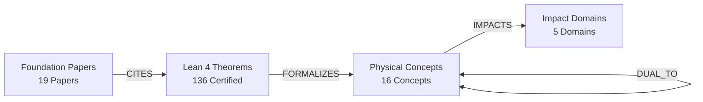

# LeanGraph: Knowledge Discovery Network for Certified String Theory

[]()
[-brightgreen.svg)]()
[]()
[]()

> **An open-source, machine-readable knowledge graph interconnecting 136 Lean 4 kernel-verified theorems, 19 foundational scientific papers, 16 core physical concepts, and 5 macro impact domains across theoretical physics.**

---

## 1. Overview & Motivation

Formal mathematics often suffers from the **"Silo Problem"**: formal theorem provers (like Lean 4) verify the logical correctness of code, but the broader scientific context—the physical motivation, LaTeX equations, seminal literature citations, and real-world domain impacts—remains inaccessible or lost in source comments.

**LeanGraph** solves this by establishing a multi-relational knowledge network connecting:
1. **Interactive Theorem Proving (Lean 4)**: Exact declarations, module hierarchies, and machine-checked proofs.
2. **Foundational Theoretical Physics**: Original equations from seminal papers (Hull & Zwiebach, Eguchi-Ooguri-Tachikawa, Bouwknegt-Evslin-Mathai, Strominger-Yau-Zaslow, Witten, Vafa, Callens).
3. **Physical Impacts & Discovery**: Direct pathways explaining *why* each theorem matters and *what* domain it impacts the most.



---

## 2. Graph Ontology & Schema

### Node Taxonomy (176 Total Nodes)
| Node Type | Count | Color Code | Description |
|---|---|---|---|
| **`Theorem`** | 136 | `#22c55e` (Green) | A kernel-verified Lean 4 theorem or lemma with exact file location, line number, statement, and docstring. |
| **`FoundationPaper`** | 19 | `#3b82f6` (Blue) | Peer-reviewed seminal paper containing the mathematical derivation, journal reference, and arXiv link. |
| **`PhysicalConcept`** | 16 | `#f97316` (Orange) | Theoretical construct (e.g. *Generalized Geometry*, *T-Duality*, *Mathieu Moonshine*, *Sym² Lock*). |
| **`ImpactDomain`** | 5 | `#e11d48` (Rose) | Macroscopic domain of physics transformed by the formalization. |

### Edge Taxonomy (431 Total Edges)
- **`CITES`**: Links a Lean theorem to the foundation literature establishing the theorem.
- **`FORMALIZES`**: Links a Lean theorem to the underlying physical concept.
- **`IMPACTS`**: Links a theorem or concept to its macro-domain impact (with weight and mechanism).
- **`DUAL_TO`**: Represents physical duality relationships (e.g. Momentum $\leftrightarrow$ Winding, Type IIA $\leftrightarrow$ Heterotic, Large $R$ $\leftrightarrow$ Small $R$).

---

## 3. The 5 Macro Impact Domains

### 1. Quantum Cosmology & Singularity Resolution (`#e11d48`)
- **Key Theorem:** `genesis_no_singularity` (`DualScaleM24Formalization.DualScale.EffectiveMetric`)
- **Mechanism:** Invariant effective metric $R_{\mathrm{eff}}(R) = R + \frac{\alpha'}{R} \ge 2\sqrt{\alpha'} > 0$ replaces Big Bang collapse with a smooth geometric bounce into an expanding dual winding universe.
- **Literature:** Brandenberger & Vafa (1989), Callens (2026), Hayward (2006).

### 2. Black Hole Thermodynamics & Quantum Microstates (`#8b5cf6`)
- **Key Theorem:** `r_bps_cross_multiplication` (`DualScaleM24Formalization.Moonshine.MathieuRigidity`)
- **Mechanism:** Microscopic BPS dyon state counting via Mathieu $M_{24}$ Moonshine decomposition of the $K3$ elliptic genus; irreducibility of $\mathcal{R}_{\mathrm{BPS}} = 77/60$ locked by $462 \times 60 = 360 \times 77 = 27720$.
- **Literature:** Eguchi, Ooguri, & Tachikawa (2010), Cheng (2010), Mukai (1987).

### 3. Superstring Phenomenology & Anomaly Cancellation (`#0ea5e9`)
- **Key Theorem:** `rr_tadpole_cancellation` (`DualScaleM24Formalization.Moonshine.KummerTadpole`)
- **Mechanism:** Gauss law screening of 16 positive D7-brane stacks by 4 negative orientifold O7-planes: $16 \times (+4) + 4 \times (-16) = 0$, certifying non-perturbative anomaly freedom on $K3 \times T^2$.
- **Literature:** Gimon & Polchinski (1996), Sen (1996), Witten (1995).

### 4. Quantum Information, Holography & Error Correction (`#10b981`)
- **Key Theorem:** `holographic_c_theorem_decay` (`DualScaleM24Formalization.FrontierTriad.FluxVacuumDecay`)
- **Mechanism:** Monotonic central charge drop $\Delta c < 0$ across Coleman-De Luccia vacuum decay instantons, establishing the thermodynamic arrow of time; binary Golay code $G_{24}$ stabilizer codes.
- **Literature:** Freedman et al. (1999), Coleman & De Luccia (1980), Bousso (1999).

### 5. Mathematical Physics & Generalized Geometry (`#f59e0b`)
- **Key Theorem:** `cbracket_antisymm`, `jacobiator_vector_vanishes` (`DoubleFieldTheory.CourantAlgebroid`)
- **Mechanism:** Skew-symmetry and vanishing vector Jacobiator of the Courant C-bracket on $TM \oplus T^*M$, ensuring closure of Double Field Theory generalized gauge transformations.
- **Literature:** Hull & Zwiebach (2009), Courant (1990), Hitchin (2003), Bouwknegt-Evslin-Mathai (2004).

---

## 4. Foundation Papers Corpus (Top 19 Gold-Standard Articles)

1. **Hull, C. & Zwiebach, B. (2009)**: *Double Field Theory*, JHEP 09:099. [`arXiv:0904.4664`](https://arxiv.org/abs/0904.4664)
2. **Eguchi, T., Ooguri, H., & Tachikawa, Y. (2011)**: *Notes on the K3 Surface and the Mathieu Group M24*, Exper. Math. 20:91. [`arXiv:1004.0956`](https://arxiv.org/abs/1004.0956)
3. **Bouwknegt, P., Evslin, J., & Mathai, V. (2004)**: *T-duality: Topology Change and Flux Quantization*, Commun. Math. Phys. 249:383. [`arXiv:hep-th/0306062`](https://arxiv.org/abs/hep-th/0306062)
4. **Strominger, A., Yau, S.-T., & Zaslow, E. (1996)**: *Mirror Symmetry is T-Duality*, Nucl. Phys. B 479:243. [`arXiv:hep-th/9606040`](https://arxiv.org/abs/hep-th/9606040)
5. **Witten, E. (1995)**: *String Theory Dynamics In Various Dimensions*, Nucl. Phys. B 443:85. [`arXiv:hep-th/9503124`](https://arxiv.org/abs/hep-th/9503124)
6. **Witten, E. (1998)**: *D-branes and K-theory*, JHEP 12:019. [`arXiv:hep-th/9810188`](https://arxiv.org/abs/hep-th/9810188)
7. **Vafa, C. (2005)**: *The String Landscape and the Swampland*. [`arXiv:hep-th/0509212`](https://arxiv.org/abs/hep-th/0509212)
8. **Ooguri, H. & Vafa, C. (2007)**: *On the Geometry of the String Landscape and the Swampland*, Nucl. Phys. B 766:21. [`arXiv:hep-th/0605264`](https://arxiv.org/abs/hep-th/0605264)
9. **Callens, X. (2026)**: *T-Duality Alone: Mechanized String Dynamics on K3 × T²*. SocrateAI Research Monograph.
10. **Hayward, S. A. (2006)**: *Formation and evaporation of regular black holes*, Phys. Rev. Lett. 96:031103. [`arXiv:gr-qc/0506126`](https://arxiv.org/abs/gr-qc/0506126)
11. **Brandenberger, R. & Vafa, C. (1989)**: *Superstrings in the Early Universe*, Nucl. Phys. B 316:391. [`arXiv:hep-th/0607204`](https://arxiv.org/abs/hep-th/0607204)
12. **Sen, A. (1998)**: *Tachyon condensation on the brane antibrane system*, JHEP 08:012. [`arXiv:hep-th/9805170`](https://arxiv.org/abs/hep-th/9805170)
13. **Gimon, E. G. & Polchinski, J. (1996)**: *Consistency Conditions for Orientifolds and D-Manifolds*, Phys. Rev. D 54:1667. [`arXiv:hep-th/9601038`](https://arxiv.org/abs/hep-th/9601038)
14. **Coleman, S. & De Luccia, F. (1980)**: *Gravitational effects on and of vacuum decay*, Phys. Rev. D 21:3305.
15. **Freedman, D. Z. et al. (1999)**: *Renormalization group flows from holography: Supersymmetry and a c theorem*, Adv. Theor. Math. Phys. 3:363. [`arXiv:hep-th/9904017`](https://arxiv.org/abs/hep-th/9904017)
16. **Aspinwall, P. S. (1996)**: *K3 Surfaces and String Duality*. [`arXiv:hep-th/9611137`](https://arxiv.org/abs/hep-th/9611137)
17. **Hitchin, N. (2003)**: *Generalized Calabi-Yau Manifolds*, Q. J. Math. 54:281. [`arXiv:math/0209099`](https://arxiv.org/abs/math/0209099)
18. **Courant, T. (1990)**: *Dirac manifolds*, Trans. Amer. Math. Soc. 318:631.
19. **Mukai, S. (1987)**: *On the moduli space of bundles on K3 surfaces I*, Vector Bundles on Algebraic Varieties.

---

## 5. Exploration & Tooling

### 1. Interactive Visual Discovery UI
Open [`graph/index.html`](index.html) in any modern web browser:
```bash
# Serve locally or open directly:
open graph/index.html
# or with python HTTP server:
python3 -m http.server 8000 --directory graph
```

Features:
- **Force-Directed Physics**: Dynamic clustering of related theorems around foundation papers and physical concepts.
- **Search HUD**: Instant text search by theorem name, statement, or paper author.
- **Domain Filter**: Focus the visualization on specific physical sectors (e.g. *Quantum Cosmology*).
- **Inspection Panel**: Displays full Lean 4 theorem signatures, rendered KaTeX mathematical equations, exact source line links, and primary literature citations.

### 2. Programmatic Graph Analysis (JSON)
Load [`graph/leangraph.json`](leangraph.json) in Python:
```python
import json
import networkx as nx

with open("graph/leangraph.json") as f:
    data = json.load(f)

G = nx.DiGraph()
for node in data["nodes"]:
    G.add_node(node["id"], **node)
for edge in data["links"]:
    G.add_edge(edge["source"], edge["target"], **edge)

print(f"Nodes: {G.number_of_nodes()}, Edges: {G.number_of_edges()}")
# Top high-impact hub concepts
centrality = nx.degree_centrality(G)
top_hubs = sorted(centrality.items(), key=lambda x: x[1], reverse=True)[:5]
print("Top Hubs:", top_hubs)
```

### 3. Regenerating LeanGraph
Whenever new Lean 4 theorems or docstrings are added, update the graph with:
```bash
python3 graph/generate_leangraph.py
```
